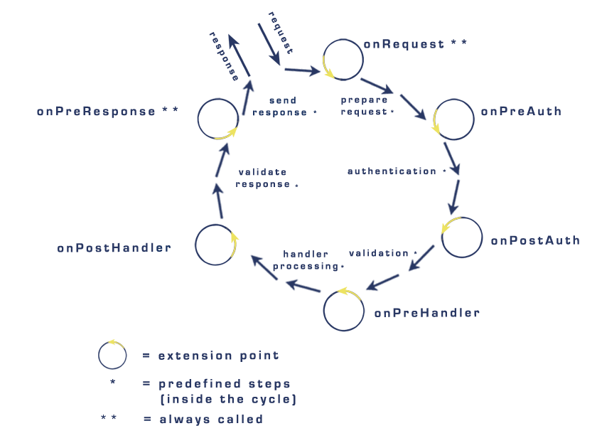
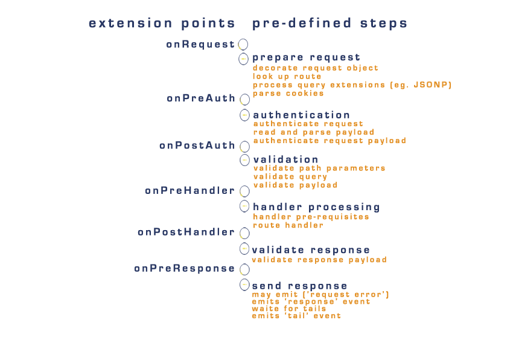

### Introduction to the Request Lifecycle

The request lifecycle determines how requests are handled by the framework.
Each incoming request passes through six general pre-defined steps. These six steps have optional extension points.

### Lifecycle Overview 

The six general pre-defined steps do not operate in a vacuum. They respond to how you configure the server, connections, and routes. 
[hapi lifecycle documentation](https://hapijs.com/api#request-lifecycle) gives more details and describes fifteen pre-defined steps versus six.
The below diagram shows all fifteen pre-defined steps, the six general pre-defined steps, and the six optional extension points.  

### Lifecycle Details Diagram

* Believe Matt Harrison 's [hapijs book](https://www.manning.com/books/hapi-js-in-action) also groups the fifteen predefined steps into six groups.
  Seems  @AdriVanHoudt references Harrison's work [here](https://gist.github.com/AdriVanHoudt/562f537ba48301bac76fb3bc42def5b3)

### extending the lifecycle

The pre-defined steps of the lifecycle can be extended by the developer with extensions.
Find the six request lifecycle extension points in the first diagram.  They are:
* 'onRequest'
* 'onPreAuth' 
* 'onPostAuth' 
* 'onPreHandler'
* 'onPostHandler'
* 'onPreResponse'

### What is an extension point? 
An extension point is a stage in the request lifecycle where extensions can be added.
Extension points are hooks that provide an interface for programmers to add custom code 
to a specific step in the lifecycle. hapi refers to the added custom code as ***events***.
There are only two extension points guaranteed to be called with every request. The first diagram marks 
them with double asterisks (**).

### What is an extension? 
An extension is an event added to the request lifecycle by the programmer. 
The event is an object which has a method to be executed before proceeding to the next step of the lifecycle.
An extension is registered using [server.ext(events)](https://hapijs.com/api#serverextevents) or by configuring
[route options](https://hapijs.com/api#route-options) of the [route configuration object](https://hapijs.com/api#route-configuration) . 
`events` is an object or array of objects with the following: 
  * type - The name of the extension point in the lifecycle where the event is going to be added. 
  * method - a function or an array of functions to be executed at the specified point in the lifecycle. 
  * options (optional object)

Note: 
* Not just one event but an array of events can be added at an extension point with [server.ext(events)](https://hapijs.com/api#serverextevents).
* For an example of using [route options](https://hapijs.com/api#route-options) to add an extension see [assignment9](../assignments/a0.0.9.md).

### Three levels of extensions:
@todo write gentle introduction to extension-levels.
* **connection-level** 
  Extends the lifecycle of all requests made to any route on a specific server connection. 
  Our project has two connections:
  - `const web = server.select('web');`
  - `const webTls = server.select('web-tls');`
  - The manifest declared in `lib/start.js` configures connections for our server.
  - `lib/index.js` applies ***connection-level*** extensions to the `web` and `webTls` connections.

* **plugin-level** 
  Extends the lifecycle of all requests made to routes within a plugin.
* **route-level** 
  Extends the lifecycle of requests made to a specific route.

### Beauty of the hapi request lifecycle
Hapi gives the developer the ability to extend the request lifecycle on:  
server connections, plugins, and routes. Plus, the added extension's (events) are configured to execute at one of the
six different extension points of the request lifecycle. Every time an extension is added the developer determines two crucial issues:
* **extension-level**  
  Determines which route(s) will have the extension applied:
  - all routes of a specific server.connection - *connection-level*
  - all routes of a specific plugin - *plugin-level*
  - or a specific route - *route-level*
* **extension-point** 
  Determines where in the request lifecycle an extension will be added. 

To see a **connection-level** extension changed to a **route-level** extension study [assignment9](../assignments/a0.0.9.md).
Once you understand the core concepts of [assignment9](../assignments/a0.0.9.md) try exploring [route prerequisites](https://hapijs.com/api#route-prerequisites).

hapi extending!

### Helpful References:
* Documentation 
  - [lifecycle](https://hapijs.com/api#request-lifecycle)
  - [server.ext(events)](https://hapijs.com/api#serverextevents) - Register an array of event objects on ***connection-level*** extension point. 
  - [server.ext(event, method, [options])](https://hapijs.com/api#serverextevent-method-options) - Register a single extension event as a ***connection-level*** extension point.
  - What is a hook?
    A hook is functionality provided by software for users of that software to have their own code called under certain circumstances. 
    That code can augment or replace the current code. 
    (source: [SO](https://stackoverflow.com/questions/467557/what-is-meant-by-the-term-hook-in-programming))

* Others:
  - @devinivy [tutorial covering realms and extensions](https://github.com/hapijs/discuss/issues/241) 
  - [route prerequisites](https://hapijs.com/api#route-prerequisites) 
    hapi allows the developer to add [pre-requisites](https://hapijs.com/api#route-prerequisites) to routes! 
    route pre-requisites are route-level extensions executed before the handler.  
  - Matt Harrison 's [hapijs book](https://www.manning.com/books/hapi-js-in-action)
  - @AdriVanHoudt 's [nodeconf talk proposal](https://gist.github.com/AdriVanHoudt/562f537ba48301bac76fb3bc42def5b3)

